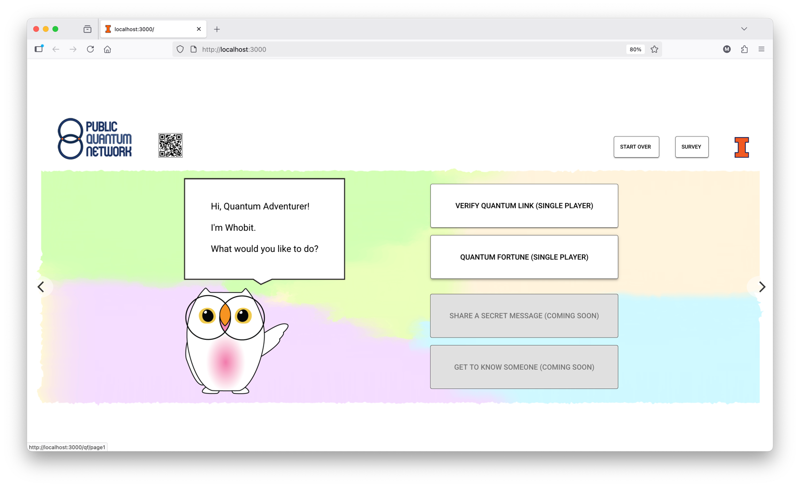

# PQN GUI

**Web interface for Public Quantum Network (PQN) nodes**

An interactive web interface designed for the general public to interact with quantum networks.

<p align="center">
  
  <br>
  <em>PQN web interface for public interaction with a quantum network</em>
</p>

> [!NOTE]
> For complete project information, architecture details, and backend setup, see the [pqn-stack repository](https://github.com/PublicQuantumNetwork/pqn-stack).

## Quick Start

### Prerequisites

- Node.js 18 or higher and npm package manager (to install please follow the instructions in [this link](https://docs.npmjs.com/downloading-and-installing-node-js-and-npm))
- A PQN Node API (see [pqn-stack](https://github.com/PublicQuantumNetwork/pqn-stack))

### Installation

  If you've just installed the PQN Node API, make sure not to be in the pqn-stack directory. A convenient place to put the GUI is in the same place you cloned pqn-stack.

1. **Clone the repository**

   ```bash
   git clone https://github.com/PublicQuantumNetwork/pqn-gui.git
   cd pqn-gui
   ```

2. **Install dependencies**

   ```bash
   npm install
   ```

### Run the Development Server

1. Run the PQN Node API.
  
2. Open a new terminal window to run the GUI. It can be run in development mode, which updates to live changes to code:
  
    ```bash
    npm run dev
    ```
  
    or in production mode, which is faster than development mode:
  
    ```bash
    npm run build
    npm run start
    ```

Open [http://localhost:3000](http://localhost:3000) in your browser to see the interface.

## Configuration

To add additional nodes, follow the instructions for back-end and front-end installation. The PQN Node is built with the expectations that it has another Node to be its follower and vice-versa. At the moment we are not supporting a third node.

To configure the API endpoints, create a `.env.local` file in the root of the project:

```bash
NEXT_PUBLIC_API_ADDRESS=127.0.0.1:8000  # Address of the PQN Node running
NEXT_PUBLIC_TIMETAGGER_ADDRESS=127.0.0.1:8000  # Address of the PQN Node with a timetagger; the protocol will use the timetagger in this Node.
NEXT_PUBLIC_FOLLOWER_NODE_ADDRESS=127.0.0.1:8000  # Address of the second PQN Node with which 2 player games will be performed.
```

Replace the addresses with your actual Node API endpoints if they differ from the defaults.

## Learn More

- [pqn-stack](https://github.com/PublicQuantumNetwork/pqn-stack) - Backend software stack and complete project documentation
- [Public Quantum Network](https://publicquantumnetwork.org) - Learn more about the PQN project

## Have questions?

Feel free to contact the PQN team at publicquantumnetwork@gmail.com.
